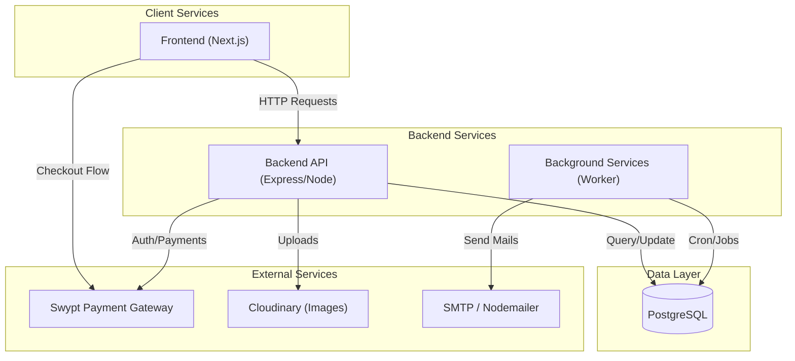
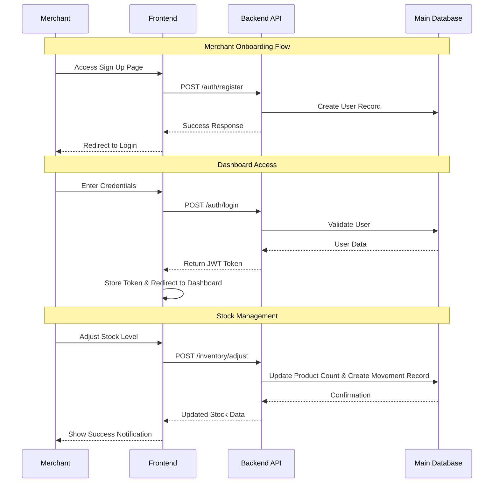

# Kifaru Swypt

Kifaru Swypt is a comprehensive solution designed to bridge the gap between cryptocurrency payments and traditional merchant operations. It integrates a robust merchant dashboard with a crypto-payment checkout system, enabling businesses to manage inventory, sales, and payments seamlessly.

## 🏗 System Architecture

The project follows a modern microservices-inspired architecture, separated into three distinct components:

1.  **Frontend (`kifaruFrontend`)**: Built with **Next.js 14**, providing a responsive and dynamic user interface for merchants.
2.  **Backend (`kifaruBackend`)**: A RESTful API built with **Node.js, Express, and TypeScript**, handling business logic, authentication, and inventory management.
3.  **Background Services (`bgServices`)**: A dedicated worker service for handling asynchronous tasks like email notifications and scheduled cron jobs.
4.  **Database**: **PostgreSQL** serves as the primary data store.
5.  **Infrastructure**: Docker is used for containerization, ensuring consistent environments across development and production.

### System Architecture Diagram



## 🔄 User & Data Flow

The typical flow for a merchant involves registration, dashboard access, and inventory management.

### Key User Flows
1.  **Merchant Onboarding**: Registration -> Email Verification -> Login.
2.  **Inventory Management**: Dashboard -> View Products -> Add/Edit Stock -> Update Database.
3.  **Checkout Process**: Customer Selects Product -> Swypt Checkout -> Payment Verification -> Stock Decrement.

### User Flow Diagram



## 🛠 Technology Stack & Design Decisions

### Frontend
-   **Framework**: [Next.js 14](https://nextjs.org/) (App Router) was chosen for its server-side rendering capabilities, SEO benefits, and simplified routing.
-   **Styling**: **TailwindCSS** + **Ant Design** ensures a modern, clean aesthetic while providing a rich set of pre-built components for the dashboard.
-   **State/Data**: **Axios** is used for efficient API communication.

### Backend
-   **Runtime**: **Node.js** with **Express** provides a lightweight yet powerful server environment.
-   **Language**: **TypeScript** is strictly enforced to ensure type safety, reduce runtime errors, and improve code maintainability.
-   **Database**: **PostgreSQL** was selected for its reliability, relational integrity, and robust support for complex queries defined in `sqlConfig.ts`.
-   **Architecture**: A helper/service pattern is used (`controllers` -> `services` -> `repositories`) to decouple business logic from data access.

### DevOps
-   **Docker**: A `docker-compose.yaml` file defines the services, making it trivial to spin up the entire stack with a single command.

## 🚀 Setup & Installation

### Prerequisites
-   Node.js (v18+)
-   Docker & Docker Compose
-   Generic SQL Client (dbeaver, pgadmin)

### Running Locally

1.  **Clone the repository** (if not already local)
2.  **Install dependencies** in each service directory:
    ```bash
    cd kifaruSwypt/kifaruBackend && npm install
    cd ../kifaruFrontend && npm install
    cd ../bgServices && npm install
    ```
3.  **Environment Variables**: ensuring `.env` files are set up in each directory matching the examples (not provided in repo for security).
4.  **Run with Docker**:
    ```bash
    cd kifaruSwypt
    docker-compose up --build
    ```
    *This will start the Frontend on port 3000 and the Backend on port 4000.*
